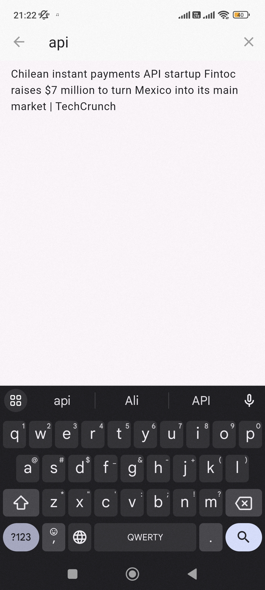

# homework_1
Домашнее задание №3 по Flutter.
Файл secret.dart содержит только ключ API и не должен лежать в репозитории (если, конечно, я правильно его добавил в .gitignore)
Реализован основной функционал (обращение к API, страница с понравившимся, базовое тестирование). Страницу с понравившимся не сохраняем, т.к. это мы должны получать с сервера. APK в корне репозитория
Реализован поиск и анимации. Реализован SliverHeader с выдвигающейся строкой поиска при скролле.

